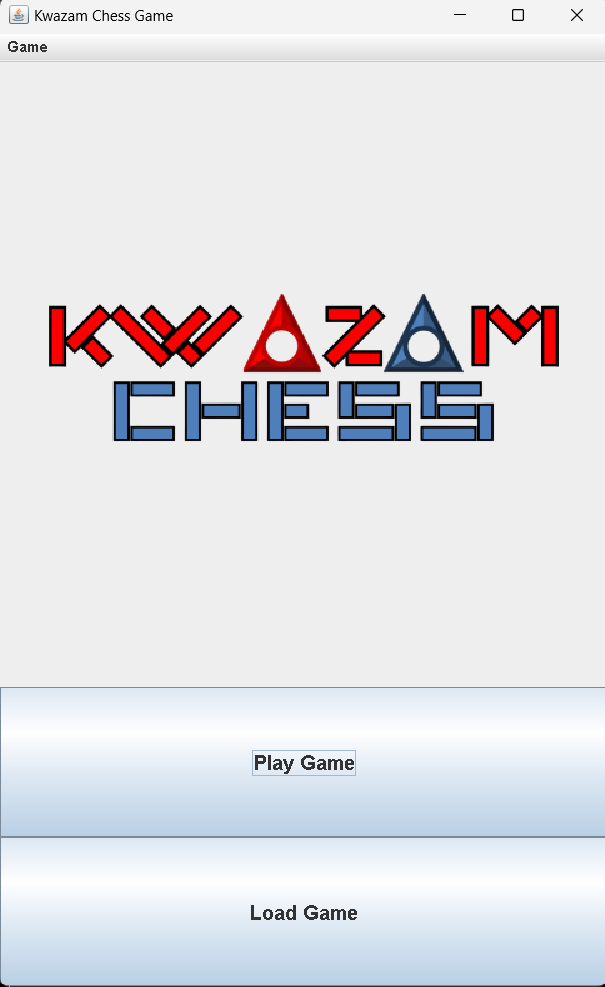
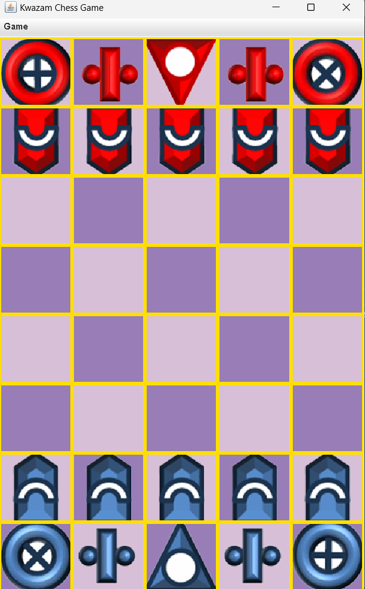

# Welcome to OOAD-KwazamChess!





# Rules

Board: 5x8

Pieces:

1. Ram - Moves 1 step forward. If reaches end of the board, turns around and head back.
2. Biz - Moves in 3x2 L shape. Can skip over other piece
3. Tor - Move orthogonally at any distance. after 2 turns, becomes Xor.
4. Xor - Move diagonally at any distance. after 2 turns, becomes Tor.
5. Sau - Moves only one step in any direction. Games ends if Sau is captured by other side.

## Requirements

1. After 2 turns (counting one blue move and one red move as one turn), all Tor pieces will turn int Xor pieces and vice versa.
2. Must use good oo design concepts such as subclassing, delegation, composition and aggregation appropriately.
3. Must use MVC pattern with Java Swing GUI. All game logic must be in model classes only.
4. May use Singleton and/or Template method, but if you do, you need to use at least one other design pattern as well.
5. You should make your program user friendly, with suitable menus, save game, resizable windows, flipping the screen when it's the other player's turn, etc.
6. For save and load game, the game should be saved into a text file so that it's human-readable.
7. Let's say if you are now playing Blue player, Red player's pieces should be 90 degree oriented facing you

## Board Layout

Plain Text Layout:
```
b-Tor b-Biz b-Sau b-Biz b-Xor
b-Ram b-Ram [ ] b-Ram b-Ram
[ ] [ ] b-Ram [ ] [ ]
[ ] [ ] [ ] [ ] [ ]
[ ] [ ] [ ] [ ] [ ]
[ ] [ ] [ ] [ ] [ ]
r-Ram r-Ram r-Ram r-Ram r-Ram
r-Xor r-Biz r-Sau r-Biz r-Tor
```
## Design Patterns

### 1. MVC (Mandatory)

Ensures a separation of concerns:

- **Model**: Contains game logic, board state, and piece behaviors.
- **View**: Displays the game board and UI components.
- **Controller**: Handles user input and communicates changes between the View and Model.

### 2. Strategy Pattern

The **Strategy Pattern** is used to define a family of algorithms, allowing a piece to choose its movement strategy at runtime. In your project, classes like `BizMovement` and `RamMovement` encapsulate different movement behaviors, letting each piece use its specific movement logic without hardcoding it in the piece itself.

### 3. Singleton Pattern

The **Singleton Pattern** ensures that a class has only one instance, providing a global point of access. In your project, the `KwazamController` follows this pattern to ensure there is only one instance of the controller, which manages the interaction between the model and the view.

## Folder Structure
```
.
│   Main.java
│   README.md
│
├───Assignment_Report
│   │   Assignment.pdf
│   │   Explain Idea logic.docx
│   │   TT9L_Group G_Assignment_Report.pdf  
│
├───audio
│   │   win1.wav
│   │   win2.wav
│
├───Controller
│   │   ChessController.java
│
├───image
│   │   b-BizPiece.png
│   │   b-RamPiece.png
│   │   b-SauPiece.png
│   │   b-TorPiece.png
│   │   b-XorPiece.png
│   │   Logo.png
│   │   r-BizPiece.png
│   │   r-RamPiece.png
│   │   r-SauPiece.png
│   │   r-TorPiece.png
│   │   r-XorPiece.png
│   │   trophys.png
│
├───Model
│   │   Biz.java
│   │   ChessModel.java
│   │   KwazamBoard.java
│   │   KwazamPiece.java
│   │   Ram.java
│   │   Sau.java
│   │   Tor.java
│   │   Xor.java
│   │
│   └───Movement
│       │   BizMovement.java
│       │   MovementStrategy.java
│       │   RamMovement.java
│       │   SauMovement.java
│       │   TorMovement.java
│       │   XorMovement.java
│
├───Save_game
│   │   saved.txt
│
└───View
    │   ChessBoard.java
    │   ChessMenu.java
    │   ChessMenuBar.java
    │   ChessPiece.java
    │   ChessView.java
    │
    └───Dialog
        │   GameOverDialog.java
        │   QuitDialog.java
```
"# KwazamChess-java" 
